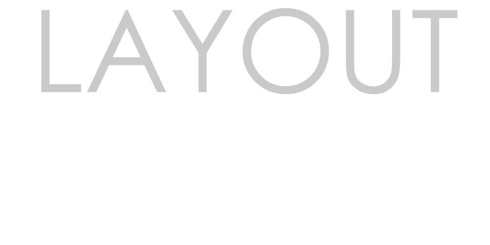

# Layout Forge

 


A simple and powerful desktop application to organize and prepare images for printing on A4 sheets, ideal for prototyping tabletop/card games and other printing projects.

---

### ✨ Features (What It Does)

* **Intuitive Upload:** Drag and drop multiple images directly into the application.
* **Dynamic Layout:** Automatically calculates the maximum number of images that fit on an A4 sheet based on the provided dimensions.
* **Easy Organization:** Reorder images by dragging and dropping, and duplicate or remove with a click.
* **Flexible Output Options:**
    * Stretch images to fill the space (`Stretch to Fit`).
    * Add or remove a thin border to facilitate cutting.
    * Export files as JPG or PDF.

---

### 📥 Download
**https://github.com/pvargas01/LayoutForge/releases**

---

### 🚀 How to Run (from Source Code)

If you are a developer and want to run the project from the source code, follow these steps:

**Prerequisites:**
* Python 3.8+
* Git

**Steps:**

1.  **Clone the repository:**
    ```bash
    git clone [https://github.com/pvargas01/LayoutForge.git](https://github.com/pvargas01/LayoutForge.git)
    cd YOUR_REPOSITORY
    ```

2.  **Create a virtual environment (recommended):**
    ```bash
    python -m venv .venv
    # On Windows
    .venv\Scripts\activate
    ```

3.  **Install the dependencies:**
    ```bash
    pip install -r requirements.txt
    ```

4.  **Run the app:**
    ```bash
    python app/main.py
    ```

---

### 🛠️ Technologies Used

* **Back-end:** Python, Flask, PyWebView, Pillow
* **Front-end:** HTML, Tailwind CSS, JavaScript, SortableJS
* **Packaging:** PyInstaller

---

### 📄 License

This project is distributed under the MIT License. See the `LICENSE` file for more details.
